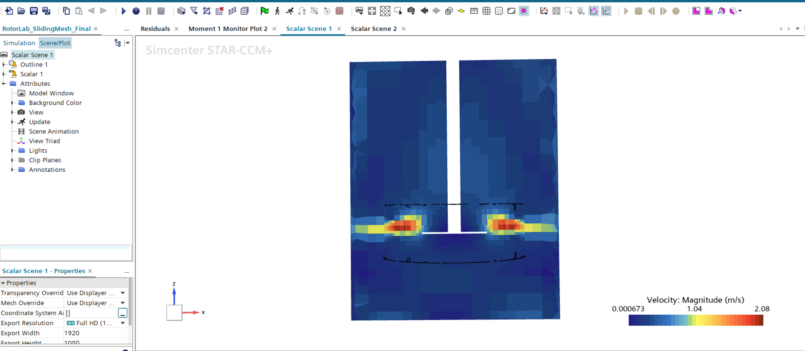
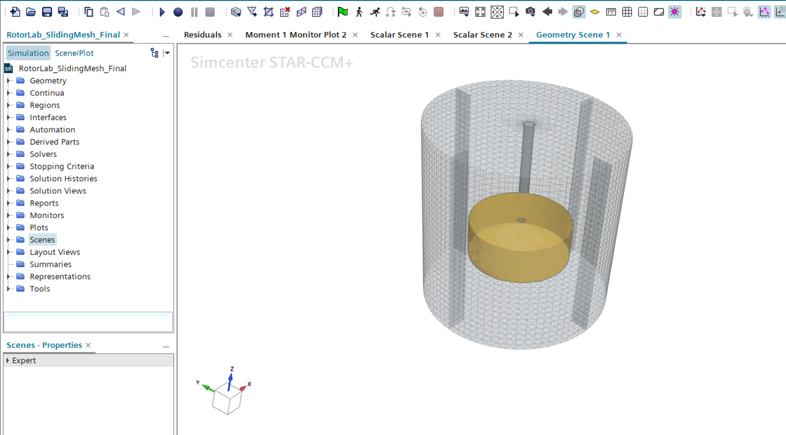
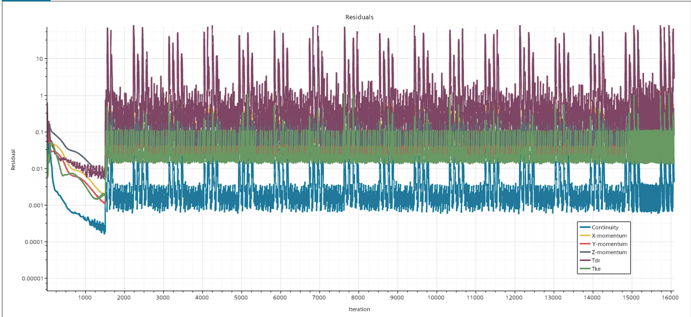
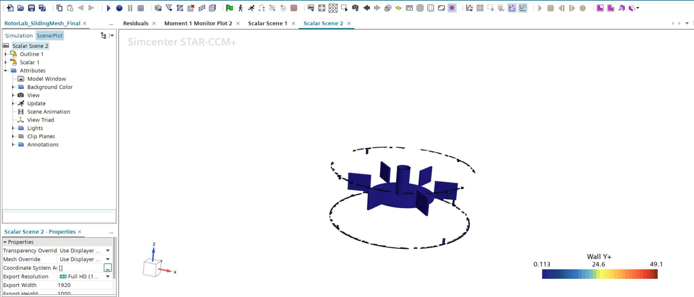

# RotorLab — Rushton Turbine Stirred-Tank CFD Benchmark

**Steady MRF vs. transient sliding mesh in Simcenter STAR-CCM+ — and the dimensional audit that found why neither matched the benchmark.**

A self-directed CFD study on a baffled Rushton turbine stirred tank. The case was built twice — once with a steady Moving Reference Frame approximation, once with a fully transient sliding mesh — and compared against the published Power Number correlation (Po ≈ 5.0).

Both methods agreed with each other to within 1.7% and both sat ~2.1× above the benchmark. **That discrepancy has been traced to a geometry defect, not a modeling one.** The diagnostic path to that answer is the substance of this project.

> **Status:** root cause identified and quantified; corrected rebuild and re-run pending. The Power Number values below are the *as-built* results and are **not** valid benchmark comparisons. See [Root Cause](#root-cause-blade-radial-placement) below and [`docs/ERRATUM.md`](docs/ERRATUM.md).

---

## Root Cause: Blade Radial Placement

The six impeller blades were built with their inner edges at the disc's outer radius rather than straddling it. Standard Rushton geometry places a blade of length D/4 spanning r = 0.025 → 0.050, crossing the disc edge at r = 0.0375. As built, the blades span r = 0.0365 → 0.0615.

**Consequence:** swept diameter D = 0.123 m instead of the intended 0.100 m — 23% oversized.

Blade torque scales as (r₂⁴ − r₁⁴) for a fixed blade height:

| | r₁ | r₂ | (r₂⁴ − r₁⁴) |
|---|---|---|---|
| As built | 0.0365 | 0.0615 | 1.2531 × 10⁻⁵ |
| Standard | 0.0250 | 0.0500 | 5.8594 × 10⁻⁶ |
| | | **Predicted ratio** | **2.139** |

| | Torque |
|---|---|
| Benchmark-implied (Po = 5.0, D = 0.100 m) | 0.1986 N·m |
| Measured (sliding mesh) | 0.4236 N·m |
| **Measured ratio** | **2.134** |

**2.139 predicted vs. 2.134 measured — a 0.3% match.** The entire discrepancy is accounted for by blade placement. No turbulence-model or discretization explanation is required.

Because only blade *position* changed while blade length, height, and disc diameter retained their D = 0.100 m values, the as-built impeller is not a geometrically similar larger Rushton either (blade length/D = 0.20 vs. 0.25 standard; disc/D = 0.61 vs. 0.75). The Po ≈ 5.0 correlation does not describe it, and recomputing with the true D = 0.123 m gives Po = 3.79 — undershooting for the same reason. Neither figure was ever a valid benchmark comparison.

### How it was found

An earlier working hypothesis attributed the gap to steady MRF's inability to resolve blade-passage unsteadiness. Sliding mesh was the direct test — and refuted it, landing within 1.7% of MRF rather than moving toward the benchmark. A second hypothesis blamed the Realizable K-Epsilon closure; that was discarded once the magnitude was checked against the literature, where k-epsilon bias for Rushton geometries is documented at roughly 10–30%, not 110%.

A dimensional audit then proceeded by elimination:

| Check | Result | Conclusion |
|---|---|---|
| `Position[X]` max on ImpellerWall | 0.0807 m | Faces present at RotZone radius (0.081) — boundary composition suspect |
| Surface area of ImpellerWall (via `∫ρ dA / ρ`) | 0.0192 m² | Matches standard impeller component sizing (~0.019 m²) — boundary is impeller-only; the r=0.081 faces are negligible slivers |
| `Position[X]`, `Position[Y]` max on Z-threshold slice (0.085–0.115 m) | 0.0596, **0.0613 m** | **Blade tips at r ≈ 0.0615, not 0.050** |

Surface area alone could not have caught this — area is invariant to radial placement. Isolating the blades by Z-threshold and measuring radius directly is what resolved it.

---

## As-Built Results

Reported for completeness. Valid as a method-to-method comparison; **not** valid against the published benchmark.

| Metric | Steady MRF | Sliding Mesh |
|---|---|---|
| Converged torque | 0.41666 N·m | 0.42362 N·m (period-averaged) |
| Po (computed with intended D = 0.100 m) | 10.49 | 10.67 |
| Agreement with each other | — | within 1.7% of MRF |

### What remains valid

**MRF–sliding mesh agreement (1.7%).** Both methods faithfully simulated the same geometry and converged to consistent answers. That cross-validation is unaffected by the geometry defect.

**Periodic torque structure.** The sliding-mesh signal settled into a repeating pattern with a **~0.1 s fundamental period — half a revolution, not a full one.** With 6 blades and 4 baffles, `gcd(6,4) = 2`, so the combined rotor–stator spatial pattern repeats every 180°. This depends only on blade and baffle *counts*, not on radial placement, and is unaffected by the defect. Steady MRF cannot produce it at all, since it freezes the rotor at one angular position.



*Velocity magnitude (Lab Reference Frame) on a plane section: radial discharge jet splitting into upper and lower circulation loops, confirming both fluid regions are fully coupled across the sliding interface.*

---

## Case Setup

| Parameter | Intended | As built |
|---|---|---|
| Tank diameter (T) | 0.300 m | 0.300 m |
| Impeller diameter (D) | 0.100 m | **0.123 m** |
| Blade span (r₁ → r₂) | 0.025 → 0.050 m | **0.0365 → 0.0615 m** |
| Blade length / height / thickness | 0.025 / 0.020 / 0.002 m | same |
| Disc diameter / thickness | 0.075 / 0.002 m | same |
| Shaft diameter | 0.015 m | same |
| Blades / baffles | 6 at 60° / 4 at 90° | same |
| Baffle width / height | 0.030 m / 0.300 m | same |
| Rotation rate (N) | 5 rev/s (300 rpm) = 31.416 rad/s | same |
| Fluid | Water — 998 kg/m³, 0.001 Pa·s | same |
| Mesh | 788,728 cells, trimmed + prism, two regions | same |
| Turbulence | Realizable K-Epsilon Two-Layer, Two-Layer All Y+ | same |
| Interface | Internal / In-place / Imprinted, `Reset on Relative Motion` for transient | same |
| Timestep (transient) | 5.5556×10⁻⁴ s (1°/step, 360 steps/rev) | same |
| Run length (transient) | ~0.81 s ≈ 8 revolutions, 10 inner iterations/step | same |

**Power Number:** `Po = Torque × 2πN / (ρN³D⁵)`



---

## Convergence



The first ~1500 iterations are the steady MRF phase converging conventionally. After the switch to sliding mesh, residuals stop trending toward zero and settle into a repeating banded pattern — the correct signature of a solution locked onto a genuine periodic state, not a stalled solve. In a transient periodic problem there is no single final answer for the across-timestep residual trend to shrink toward; what matters is the *within-timestep* drop across inner iterations, which held at roughly 5–10× per timestep throughout.



*Wall Y+ on the impeller: range 0.113–49.1, dominated by low values across most of the wetted surface.*

---

## Repository Contents

```
docs/
  ERRATUM.md                             # What the PDFs below get wrong, and why
  RotorLab_Final_Comparison_Report.pdf   # MRF vs sliding mesh vs benchmark  [superseded]
  RotorLab_MRF_Results_Report.pdf        # Steady-phase results              [superseded]
  RotorLab_SlidingMesh_Setup_Log.pdf     # Every transient setting, and why  [valid]
  RotorLab_Build_Decision_Log.pdf        # Geometry, meshing, debugging      [contains the defect]
  RotorLab_Rebuild_Runbook.pdf           # Rebuild spec                      [contains the defect]
data/
  moment_periodic_window.csv             # Torque time series over the averaging window
images/                                  # Figures used above
```

The `docs/` set is an engineering record, kept as written rather than retroactively edited — including the wrong theories and the reasoning that eventually corrected them. **[`ERRATUM.md`](docs/ERRATUM.md) states exactly what is superseded.**

---

## Selected Engineering Problems Solved

- **Blade radial placement defect (the headline finding).** A 2.1× Power Number over-prediction survived two competing explanations — steady-MRF unsteadiness and turbulence-closure bias — before a dimensional audit traced it to blade tips at r = 0.0615 instead of 0.050. The failure was invisible to mesh diagnostics, surface-area checks, and residual behavior; only direct radius measurement on a Z-thresholded slice of the boundary exposed it.
- **3D-CAD primitive convention trap.** A Cylinder primitive's "Center" field specifies the center of the *base 2D profile* before extrusion, not the volumetric center of the resulting solid. Entering the intended mid-height Z produced a rotating zone offset by half its height — a defect that passed 100% mesh face-validity checks and was caught only by direct body-extents measurement.
- **Trimmed mesher multi-part limitation.** The Trimmed Cell Mesher cannot process multiple parts in one Automated Mesh operation; resolved by splitting into two operations, which also simplified impeller-local refinement.
- **Interface type correctness.** Direct Region Interfaces silently produce a Heat Exchanger–type interface that blocks flow. Correct configuration requires Internal/In-place/Imprinted, plus `Reset on Relative Motion` for the sliding case so the flux mapping recomputes as the rotor sweeps.
- **Stopping-criterion semantics.** An Asymptotic torque criterion tuned for steady convergence repeatedly triggered prematurely on slow monotonic drift, then became conceptually invalid once the signal turned periodic — convergence had to be judged by cycle-to-cycle waveform repeatability instead.
- **Transient monitor triggering.** Monitors left on iteration-triggering sample inner-loop noise rather than converged per-timestep values; switching to timestep-triggering is what made the periodic signal legible.

## Known Limitations

- **The benchmark comparison is not yet closed.** Corrected geometry (blades moved inward 0.0115 m) has not been rebuilt or re-run. Predicted corrected torque ≈ 0.199 N·m; confirming that is the immediate next step.
- Sliding-mesh torque was averaged over a 130-timestep window (~0.736–0.810 s), slightly short of one full 0.1 s fundamental period — a working estimate, not a laboratory-grade final digit.
- No flow-field animation was produced. Repeated stop/resume cycles on the remote session desynced the Solution History file's snapshot numbering, causing recurring HDF5 write failures; recording was disabled. Core solve integrity was verified unaffected (Time-Step and Physical Time stayed exactly consistent with Δt across every resume boundary).

---

## Tools

Simcenter STAR-CCM+ · 3D-CAD · Trimmed/prism meshing · MRF and rigid-body-motion rotating machinery · RANS turbulence modeling · Python (post-processing, report generation)
