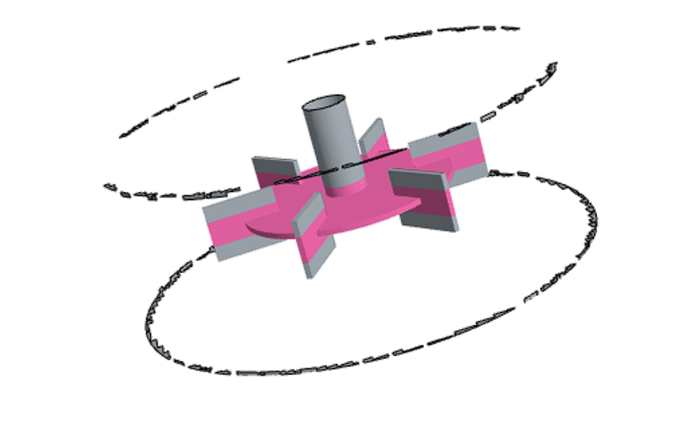
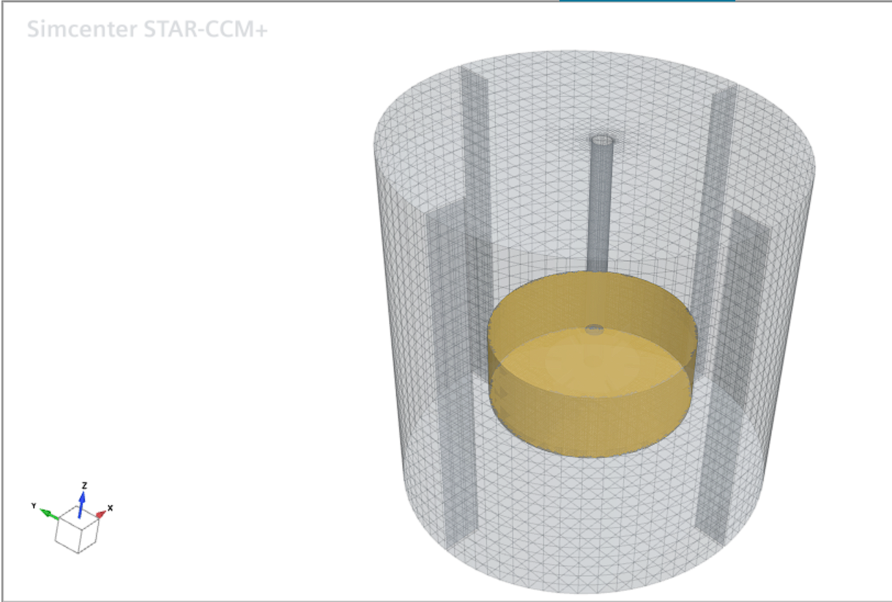
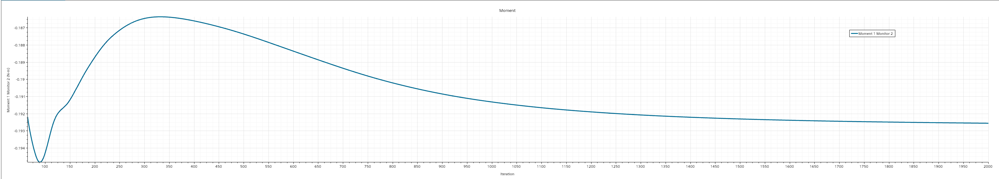
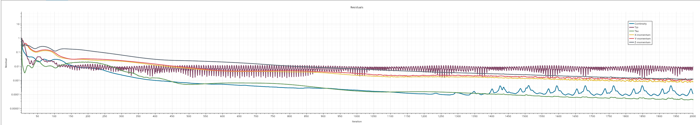
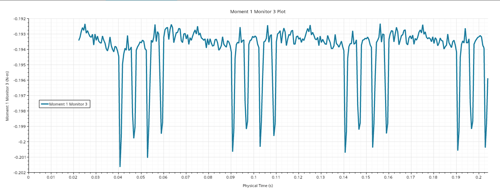
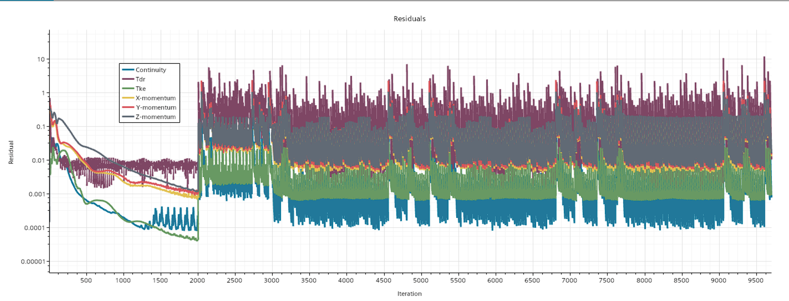
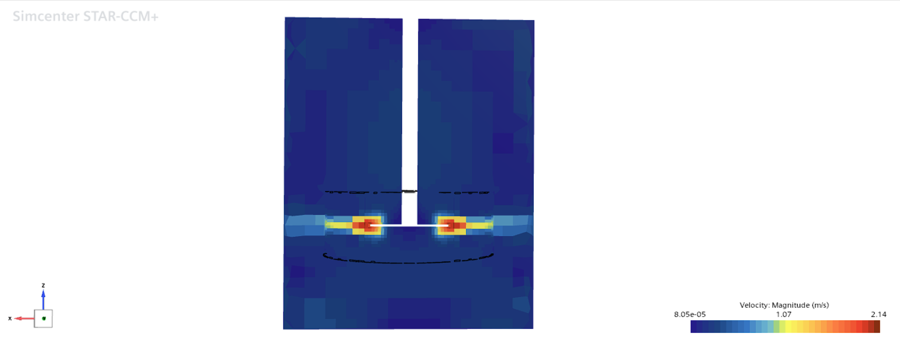
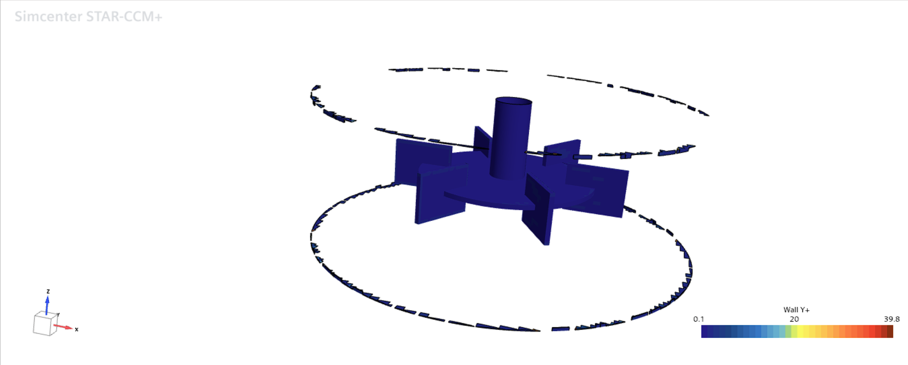

# RotorLab — Rushton Turbine Stirred-Tank CFD Benchmark

**Steady MRF vs. transient sliding mesh in Simcenter STAR-CCM+, validated against the published Power Number — and the dimensional audit that got there.**

A self-directed CFD validation study on a baffled Rushton turbine stirred tank (T = 0.300 m, D = 0.100 m, N = 5 rev/s, water). The case was built and solved with two independent rotating-machinery formulations and benchmarked against the classical Power Number correlation, Po ≈ 5.0.

The first attempt over-predicted Po by a factor of 2.1. Two plausible explanations were proposed and both were refuted by experiment. A dimensional audit traced the discrepancy to a **blade placement defect in the geometry**, the correction was predicted quantitatively before being applied, and the corrected case validated against the benchmark to within 3%.

---

## Results

| Metric | Steady MRF | Sliding Mesh | Benchmark |
|---|---|---|---|
| Torque | 0.192562 N·m | 0.193983 N·m *(time-averaged)* | — |
| **Power Number** | **4.85** | **4.89** | **≈5.0** |
| Deviation from benchmark | −3.0% | −2.3% | — |
| Agreement between methods | — | **0.74%** | — |

Both methods land inside the experimentally reported band for a standard six-blade Rushton disc turbine (roughly 4.6–6.0 depending on blade thickness and exact proportions; Rushton et al. 1950, Bates et al. 1963).

**Sliding-mesh torque was averaged over two complete periods** (0.0905 → 0.1905 s, 180 timesteps). The two periods agree to **0.003%**:

```
Period 1 mean = 0.193980 N·m
Period 2 mean = 0.193986 N·m
```

---

## The Diagnostic Arc

This is the substance of the project. The numbers above are the endpoint.

### 1. The discrepancy

The as-built case gave Po = 10.49 (MRF) and 10.67 (sliding mesh) — both ~2.1× the benchmark, but within 1.7% of *each other*.

### 2. First hypothesis — refuted

Steady MRF freezes the rotor and cannot resolve blade-passage unsteadiness, a documented weakness for radial impellers. Transient sliding mesh was the direct test. It landed within 1.7% of MRF rather than moving toward the benchmark. **Hypothesis rejected by its own experiment.**

### 3. Second hypothesis — rejected on magnitude

Realizable K-Epsilon is documented to over-predict power draw for Rushton geometries. But the documented bias is roughly 10–30%, not 110%. **The explanation could not carry the observed error.**

### 4. Dimensional audit

| Check | Result | Conclusion |
|---|---|---|
| `Position[X]` max on ImpellerWall | 0.0807 m | Faces at RotZone radius — boundary composition suspect |
| ImpellerWall surface area (via ∫ρ dA / ρ) | 0.0192 m² | Matches impeller-only sizing; interface imprint is clean, r=0.081 faces are negligible slivers |
| `Position[X]`,`[Y]` max on Z-threshold slice | 0.0596, **0.0613 m** | **Blade tips at r ≈ 0.0615, not 0.050** |

Surface area alone could not have found this — area is invariant to radial placement. Isolating the blades by Z-threshold and measuring radius directly is what exposed it.

### 5. Root cause

Blades were built as a Block primitive at Base Center `[0.0495, 0, 0.100]`, length 0.026 m — spanning **r = 0.0365 → 0.0625 m** instead of the standard **0.025 → 0.050 m**, and sitting **above** the disc plane rather than straddling it.

Swept diameter was therefore **0.125 m, not 0.100 m**.

### 6. Quantitative prediction, then confirmation

Blade torque scales as (r₂⁴ − r₁⁴) at fixed blade height:

```
As built (0.0365 → 0.0625):  1.3484e-5
Standard (0.0250 → 0.0500):  5.8594e-6
Predicted torque ratio:      2.301
```

Correction applied: Block length 0.026 → 0.025 m, Base Center → `[0.0375, 0, 0.090]`. Verified post-remesh by the same threshold measurement: **max radius 0.0500 m exactly**.

```
Predicted corrected torque:  ~0.199 N·m
Measured corrected torque:    0.192562 N·m   (MRF, 3.4% from prediction)
Measured torque ratio:        2.164          (vs 2.301 predicted, 6% from a hand-derived scaling)
```

---

## Corrected Geometry



*Blades straddling the disc plane with tips at r = 0.050 m. Verified by Maximum `Position[X]` report on a Z-thresholded slice of the ImpellerWall boundary.*



---

## Steady MRF



Converged over 2000 iterations to **0.192562 N·m**, flat to 0.003% across the final 20 iterations.



| Residual at iteration 2000 | Value |
|---|---|
| Continuity | 1.14 × 10⁻⁴ |
| X-momentum | 8.08 × 10⁻⁴ |
| Y-momentum | 1.20 × 10⁻³ |
| Z-momentum | 1.16 × 10⁻³ |
| Tke | 4.01 × 10⁻⁵ |
| Tdr | 8.75 × 10⁻³ |

---

## Transient Sliding Mesh



**The periodic structure is the transient result MRF cannot produce.** Torque settles into a strictly repeating signal with a **0.0500 s fundamental period — exactly the blade-baffle passing interval** for 4 baffles at 0.2 s/revolution. Four consecutive clusters were resolved:

| Cluster | Onset | Interval |
|---|---|---|
| 1 | 0.0405 s | — |
| 2 | 0.0905 s | 0.0500 |
| 3 | 0.1405 s | 0.0500 |
| 4 | 0.1905 s | 0.0500 |

Each cluster contains the same four-excursion deep-shallow-deep-shallow substructure, with matching amplitudes between periods. Baseline sits at −0.1935 N·m with excursions to −0.2007 N·m (3.7%).



The sawtooth is normal transient behaviour — every inner iteration is plotted, and each timestep starts high and converges down. The envelope is stationary from iteration ~3000 onward. End-of-timestep values run ~2×10⁻⁴ Continuity on clean steps to ~1.5×10⁻³ on excursion steps.

---

## Flow Field



*Velocity magnitude (Lab Reference Frame), plane section. The Rushton signature: a radial discharge jet firing outward from the blade tips at up to 2.14 m/s and splitting into upper and lower circulation loops. Both fluid regions are fully coupled across the sliding interface.*



*Wall Y+ on ImpellerWall: 0.1 – 39.8, dominated by low values across the wetted surface. Consistent with the Two-Layer All Y+ treatment.*

---

## Case Setup

| Parameter | Value |
|---|---|
| Tank diameter (T) / liquid height | 0.300 m / 0.300 m |
| Impeller diameter (D) | 0.100 m |
| Blade span (r₁ → r₂) | 0.025 → 0.050 m, straddling the disc plane at Z = 0.100 |
| Blade length / height / thickness | 0.025 / 0.020 / 0.002 m |
| Disc diameter / thickness | 0.075 / 0.002 m |
| Shaft diameter | 0.015 m |
| Blades / baffles | 6 at 60° / 4 at 90°, 0.030 m wide, full depth |
| Rotation rate (N) | 5 rev/s (300 rpm) = 31.416 rad/s |
| Fluid | Water — 998 kg/m³, 0.001 Pa·s |
| Mesh | 774,069 cells (589,829 rotating + 184,240 stationary), trimmed + prism |
| Turbulence | Realizable K-Epsilon Two-Layer, Two-Layer All Y+ |
| Interface | Internal / In-place / Imprinted, `Reset on Relative Motion` for transient |
| Timestep (transient) | 5.5556 × 10⁻⁴ s (1°/step, 360 steps/rev), 25 inner iterations |
| Run length | MRF 2000 iterations; sliding mesh 0.2033 s ≈ 1 revolution |

**Power Number:** `Po = Torque × 2πN / (ρN³D⁵)` — reduces to `Po ≈ Torque × 25.183` here.

---

## Repository Contents

```
docs/
  ERRATUM.md                             # What the PDFs get wrong, and why
  RotorLab_Final_Comparison_Report.pdf   # As-built MRF vs sliding mesh    [superseded]
  RotorLab_MRF_Results_Report.pdf        # As-built steady phase           [superseded]
  RotorLab_SlidingMesh_Setup_Log.pdf     # Transient settings and rationale [valid]
  RotorLab_Build_Decision_Log.pdf        # Geometry, meshing, debugging     [contains the defect]
  RotorLab_Rebuild_Runbook.pdf           # Rebuild spec                     [contains the defect]
data/
  slidingmesh_corrected_torque.csv       # Torque over the two-period averaging window
  moment_periodic_window.csv             # As-built equivalent
images/corrected/                        # Corrected-geometry figures (above)
images/asbuilt/                          # As-built figures, retained for reference
```

The `docs/` PDFs are an engineering record kept as written rather than retroactively edited — including the wrong theories and the reasoning that corrected them. [`ERRATUM.md`](docs/ERRATUM.md) states exactly what is superseded.

---

## Selected Engineering Problems Solved

- **Blade placement defect (headline).** A 2.1× Power Number over-prediction survived two competing physical explanations before a dimensional audit traced it to blade tips at r = 0.0625 instead of 0.050. Invisible to mesh diagnostics, surface-area checks, and residual behaviour; only direct radius measurement on a Z-thresholded boundary slice exposed it. The correction was predicted quantitatively before being applied and confirmed within 3.4%.

- **Steady-adequate meshes can fail transient.** The corrected mesh converged cleanly under MRF (Continuity 1.14×10⁻⁴) but stalled per-timestep under sliding mesh at 10 inner iterations — Continuity stuck at 4.75×10⁻². Diagnostics showed localised degeneracies from the blade-disc Boolean intersection (93.19° max skewness, 15 µm minimum centroid spacing, 3.65×10⁻¹³ m³ minimum cell volume). Typical CFL was ~0.7, but ~55 in those cells. A steady solver iterates local stiffness away; a transient solver must resolve it inside each timestep. Raising inner iterations to 25 improved end-of-timestep Continuity by **330×**.

- **3D-CAD primitive convention traps.** A Cylinder's "Center" is the base profile centre, not the volumetric centre; a Block's "Base Center" is centred in X/Y but at the base in Z. Both produced geometry offset by half a dimension, and both passed 100% mesh face-validity checks. Caught only by direct extents measurement.

- **Interface configuration.** Direct Region Interfaces silently produce a Heat Exchanger type that blocks flow. Correct setup requires Internal/In-place/Imprinted, plus `Reset on Relative Motion` so the flux mapping recomputes as the rotor sweeps — verified live by watching intersection face counts change every timestep.

- **Stopping-criterion semantics.** An Asymptotic torque criterion tuned for steady convergence triggered prematurely on slow monotonic drift, then became conceptually invalid once the signal turned periodic. Convergence had to be judged by cycle-to-cycle waveform repeatability instead.

- **Transient monitor triggering.** Monitors left on iteration-triggering sample inner-loop noise rather than converged per-timestep values. Switching to timestep-triggering is what made the periodic signal legible.

---

## Limitations

- Sliding mesh was run for ~1 revolution (0.2033 s) rather than a longer campaign. Justified by the periodicity being established across four consecutive clusters with period-to-period agreement of 0.003%, but a longer run would tighten the average further.
- The intra-cluster substructure (~4 excursions at ~0.0062 s spacing) does not map cleanly onto 6-blade, 4-baffle, or 24-encounter frequencies. Reported as observed; no mechanism claimed.
- Mesh quality at the blade-disc intersection is marginal (93.19° max skewness). Adequate for both solutions obtained, but repairing it would be the first step in any extension of this work.
- No turbulence-model sensitivity study. With both methods now inside the experimental band, this is no longer needed to explain a discrepancy, but SST k-omega would be a reasonable robustness check.

---

## Benchmark Source

> Rushton, J.H., Costich, E.W. & Everett, H.J. (1950). "Power Characteristics of Mixing Impellers," *Chemical Engineering Progress*, Vol. 46 (two parts).
>
> Bates, R.L., Fondy, P.L. & Corpstein, R.R. (1963). "An Examination of Some Geometric Parameters of Impeller Power," *Ind. Eng. Chem. Process Design & Development*, 2(4).
>
> Paul, E.L., Atiemo-Obeng, V.A. & Kresta, S.M. (eds.) (2004). *Handbook of Industrial Mixing: Science and Practice*, Wiley.

---

## Tools

Simcenter STAR-CCM+ · 3D-CAD · Trimmed/prism meshing · MRF and rigid-body-motion rotating machinery · RANS turbulence modelling · Python (post-processing, report generation)
